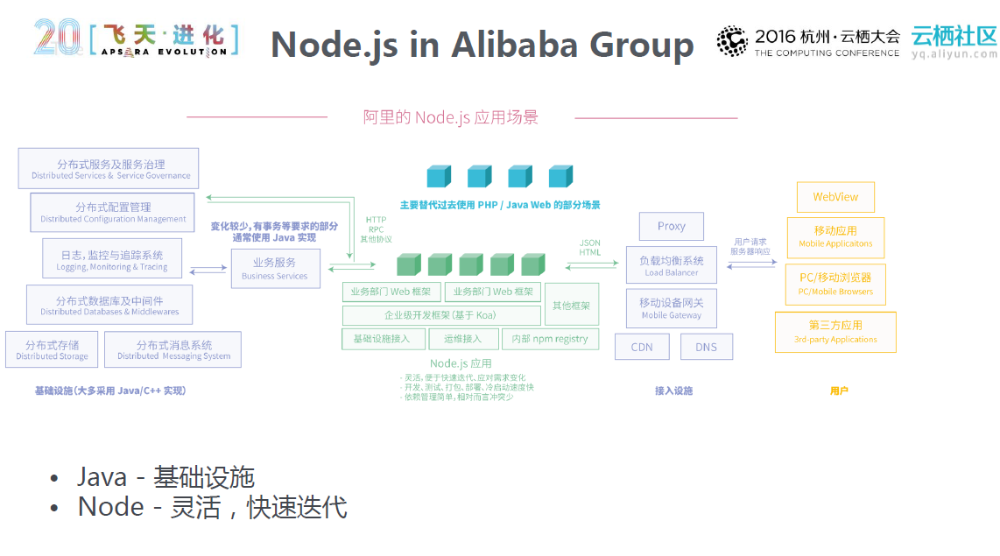
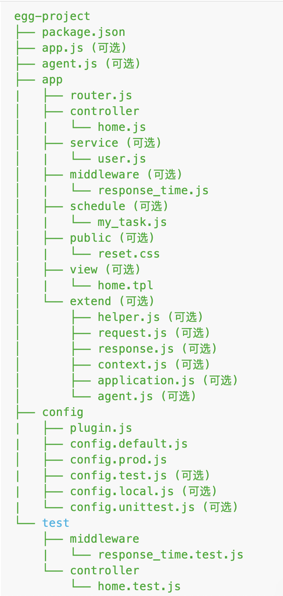
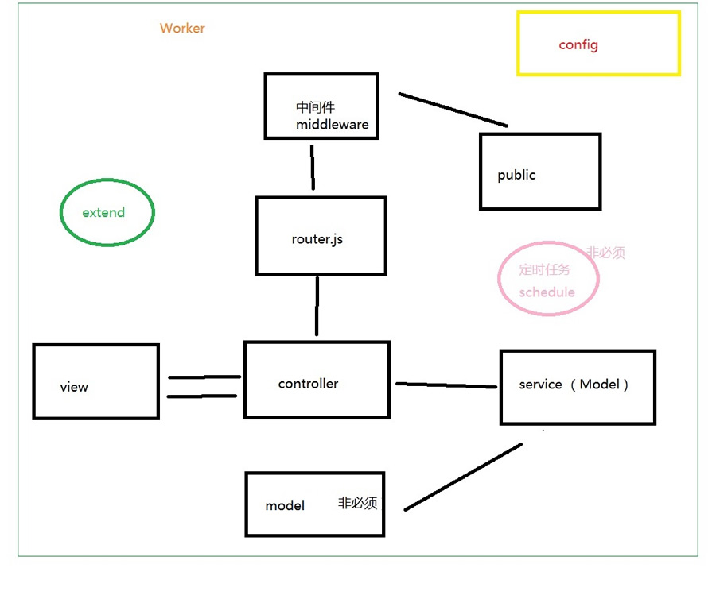

###  1. Egg.js 是什么?

Egg.js 是《阿里旗下产品》基于 Node.js 和 Koa的企业级应用开发框架。
可以帮助开发团队和开发人员降低开发和维护成本。

### 2. Egg.js 的历史

+ 2013 年蚂蚁的 chair 框架，可以视为 egg 的前身。
+ 2015 年 11 月，在苏千的召集下，阿里各 BU 的前端骨干齐聚黄龙，闭门共建。
+ 2016 年初，各 BU 的基础 web 框架完成升级，在同一套规范的基础上进行差异化定制。
+ 2016 年中，广泛使用在绝大部分阿里的前端 Node.js 应用。
+ 2016 年 09 月，在 JSConf China 2016 上亮相并宣布开源。
+ 2017 年初，官网文档 egg - 为企业级框架和应用而生 亮相，并将在本月发布 egg@1.0版本。
+ 2017 年 12 月左右 Egg 社区版 2.0 正式发布，性能提升 30%，基于 koa2 拥抱 Async
+ 2018 年 7 月最新 egg 的版本是 2.2.1

### 3.Egg的意义

Express 和 Koa 是 Node.js 社区广泛使用的框架，简单且扩展性强，非常适合做个人项
目。但框架本身缺少约定，标准的 MVC 模型会有各种千奇百怪的写法。Egg是一个MVC的框架,按照约定进行
开发，奉行『约定优于配置』，团队协作成本低。
```
MVC:
view:   视图  模板  页面的展示
Controller控制器:  负责处理一些页面逻辑的处理
Model(Service):  与数据库打交道  (查询数据库  请求数据)
```
Egg.js 基于 Es6、Es7 以及 Typescript、Koa2 使得 Nodejs 具有更规范的开发模式、更低
的学习成本、更优雅的代码、更少的开发成本、更少的维护成本。

### 4. Egg.js 的特性
+ 提供基于 Egg 定制上层框架的能力
+ 高度可扩展的插件机制
+ 内置多进程管理
+ 基于 Koa 开发，性能优异
+ 框架稳定，测试覆盖率高
+ 渐进式开发

### 5. Egg设计理念

- egg不定制技术选型,专注于提供 Web 开发的核心功能和一套灵活可扩展的插件机制
- 一个插件只做一件事,比如 Nunjucks 模板封装成了 egg-view-nunjucks、MySQL 数据库封装成了 egg-mysql
- 约定优于配置,可扩展性也很高

### 6. Egg的地位图




### 7. Egg的目录结构


* app/router.js 用于配置 URL 路由规则，具体参见 Router。
* app/controller/** 用于解析用户的输入，处理后返回相应的结果，具体参见 Controller。
* app/service/** 用于编写业务逻辑层，可选，建议使用，具体参见 Service。
* app/middleware/** 用于编写中间件，可选，具体参见 Middleware。
* app/public/** 用于放置静态资源，可选，具体参见内置插件 egg-static。
* app/extend/** 用于框架的扩展，可选，具体参见框架扩展。
* config/config.{env}.js 用于编写配置文件，具体参见配置。
* config/plugin.js 用于配置需要加载的插件，具体参见插件。
* test/** 用于单元测试，具体参见单元测试。
* app.js 和 agent.js 用于自定义启动时的初始化工作，可选，具体参见启动自定义。关于agent.js的作用参见Agent机制。
由内置插件约定的目录：
* app/public/** 用于放置静态资源，可选，具体参见内置插件 egg-static。
app/schedule/** 用于定时任务，可选，具体参见定时任务。
若需自定义自己的目录规范，参见 Loader API
* app/view/** 用于放置模板文件，可选，由模板插件约定，具体参见模板渲染。
* app/model/** 用于放置领域模型，可选，由领域类相关插件约定，如 egg-sequelize。
Loader : Egg 在 Koa 的基础上进行增强最重要的就是基于一定的约定，根据功能差异将代码 放到不同的目录下管理，对整体团队的开发成本提升有着明显的效果。Loader 实现了这约定，并抽象了很多底层 API 可以进一步扩展。
(坑)Loader 还提供了 caseStyle 强制指定首字母大小写，比如加载 model 时 API 首字母大写， app/model/user.js => app.model.Use

### 8. Egg.js执行流程图



### 9. egg底层架构实现模式

Egg继承了koa框架,关于kao的设计模式，这里简单提及：
+ 支持async function(){}
+ 中间件选择洋葱圈模型(洋葱模型，每一层的洋葱就是一个中间件，由外而内(next))
```
    // #1
    app.use(async (ctx, next)=>{
        console.log(1)
        await next();
        console.log(1);
    });
    // #2
    app.use(async (ctx, next) => {
        console.log(2);
        await next();
        console.log(2);
    });

    app.use(async (ctx, next) => {
        console.log(3);
    });

    result:1 2 3 2 1
```
+ egg基于koa的扩展：
a)通过定义app/extend/{application,context,request,response}.js来扩展 Koa 中对应的四个对象的原型
b)koa中是引入插件来做一些功能，比如koa-session koa-bodyparse
egg针对这个功能提供插件机制：
一个插件可以包含 
a>. extend：扩展基础对象的上下文，提供各种工具类、属性。
b>. middleware：增加一个或多个中间件，提供请求的前置、后置处理逻辑。
c>. config：配置各个环境下插件自身的默认配置项。

### 10.Egg的基类

Application： 全剧应用对象，一个应用中只会实例化一个，可以在上面挂在一些全局的方法和对象 -> 扩展 Application 对象 
+ 事件：在框架运行时，会在Application实例上触发一些事件，可监听事件做一些操作。应用开发一般在启动自定义脚本中进行监听，框架提供了统一的入口文件（app.js）进行启动过程自定义，这个文件只返回一个函数。
+ 访问方式：在context对象上可通过ctx.app获得
```
    module.exports = app => {
        //server: 一个worker进程只会触发一次，在http服务完成启动后，会将http server通过此事件暴露给开发者
        app.once('server', server => {
            console.log("==========server============");
        });
        //error: 运行时任何异常被onerror插件捕获后，都会触发error事件，
        //将错误对象和关联到上下文(如果有)暴露给开发者，可以进行自定义的日志上报等处理
        app.on('error', (err, ctx) => {
            console.log("==========error============");
        })
    
        //应用收到请求和响应请求时，分别触发request和response事件，并将当前请求上下文暴露出来，可记录日志
        app.on('request', ctx => {
            console.log("==========request============");
        })
        app.on('response', ctx => {
            console.log("==========response============");
        });
    }
```
Context：是一个请求级别的对象。在每一次收到用户请求时，框架会实例化一个Context对象，这个对象封装了这次用户请求的信息，并提供了许多便捷的方法来获取请求参数或者设置响应信息。框架会将所有的Service挂载到Context实例上，一些插件也会将一些其他方法和对象挂载到它上面
+ 获取方式：Controller,Service:this.ctx
+ 除了请求外，在有些非用户请求的场景下我们需要访问service/model等Context实例上的对象，可以通过
Application.createAnonymousContext()方法创建一个匿名Context实例
```
    module.exports = app => {
        app.beforeStart(async () => {
            const ctx = app.createAnonymousContext();
            // preload before app start
            await ctx.servive.posts.load();
        })
    }
```
+ 在定时任务中的每一个task都接受一个Context实例作为参数，以便执行一些定时的业务逻辑

Request & Response : 请求级别的对象，有一系列获取http请求常用参数和设置http响应的方法
+ 获取方法
可以在Context的实例上获取到当前请求的Request(ctx.request)和Response(ctx.response)实例。
koa会在Context上代理一部分方法和属性(可简写)：ctx.request.query.id === ctx.query.id   ctx.response.body === ctx.body。 但ctx.request.body !==  ctx.body

Controller: 框架提供一个Controller基类，并推荐所有的Controller都继承(extends Controller)于该基类实现

Service：框架提供一个Service基类，并推荐所有的Service都继承(extends Service)于该基类实现
+ Service中调用model一律小驼峰

Helper：用来提供一些实用的utility函数。我们可以将一些常用的动作抽离在helper.js里成为独立函数。Helper自身是一个类，有和Controller基类一样的属性，它会在每次请求时进行实例化，因此Helper上的所有函数也能获取到当前请求相关的上下文信息
+ 可以在Context实例上获取到当前请求的Helper(ctx.helper)实例。
+ 还可以在模版中获取到，如在模版中获取security插件提供的shtml方法。{{ helper.shtml(value) }}
```
    var sd = require('silly-datetime');
    module.exports = {
        formatTime(param) {
            // this 是 helper 对象，在其中可以调用其他 helper 方法
            // this.ctx => context 对象
            // this.app => application 对象
            //格式化日期  param（时间戳）
            return "我是Helper: " + sd.format(new Date(), 'YYYY-MM-DD');
        }
    };
```

Config: 配置文件 
+ 获取方式Application： app.config,Controller / Service / Helper：this.config

Logger 日志 每个logger对象都提供了4个级别的方法：logger.debug() / logger.info() / logger.warn() / logger.error() 框架中提供了多个Logger对象

Subscription: 规范化订阅模型的基类，可根据自己的需求基于它订阅规范，如定时任务

### 11.Egg Exteng && Middleware && schedule (代码演示)

### 12.Egg Post提交数据、Egg安全机制CSRF的防范以及配置模板全局变量

+ CSRF 攻击：伪造用户请求向网站发起恶意请求
+ 配置并使用 ejs 模版引擎：egg-view-egs
```
    <input type="hidden" name="_csrf" value="<%=csrf%>">
    egg.js中的全局变量一般是在中间件配置的。配置方法如下 :
        module.exports = (options, app) => {
            return async function adminauth(ctx, next) {
                ctx.state.csrf = ctx.csrf; // 全局变量    
            };
        };
```

### 13.Egg Cookie 保存在客户端浏览器中（egg中内置了Cookie对象）
```
    const Controller = require('egg').Controller;

    class HomeController extends Controller {
        async index() {
            this.ctx.cookies.set("name", "张三", {
                maxAge: 24 * 3600 * 1000,
                httpOnly: true, //仅在node中可以
                signed: true,
                encrypt: true, // 加密，并且可以设置为中文
            });
            await this.ctx.render('home');
        }
        async setCookie() {
            let name = this.ctx.cookies.get("name", {
                encrypt: true,
            });
            await this.ctx.render('getCookie', {
                name
            });
        }
    }

    module.exports = HomeController;
```
### 14.Egg Session 保存在服务器中（egg中内置了Session对象）
当浏览器访问服务器并发送第一次请求时，服务器端会创建一个 session 对象，生成一个类似于 key，value 的键值对，然后将 key(cookie) 返回到浏览器（客户）端，浏览器下次再访问时，携带 key(cookie)，找到对应的 session（value）
```
    this.ctx.session.sessionFlag = "我是session";
    let sessionFlag = this.ctx.session.sessionFlag;
```
  // 配置 Session
  config.session = {
    key: 'SESSION_ID', // 设置 Session cookies 里面的 key
    maxAge: 5000, // 5秒
    httpOnly: true,
    encrypt: true,
    renew: true, // 每次刷新页面，Session 都会被延期。
  };
### 15.代码演示（连接mongose插件直接与数据库）
